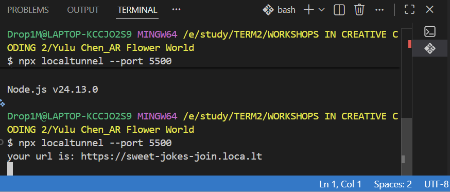
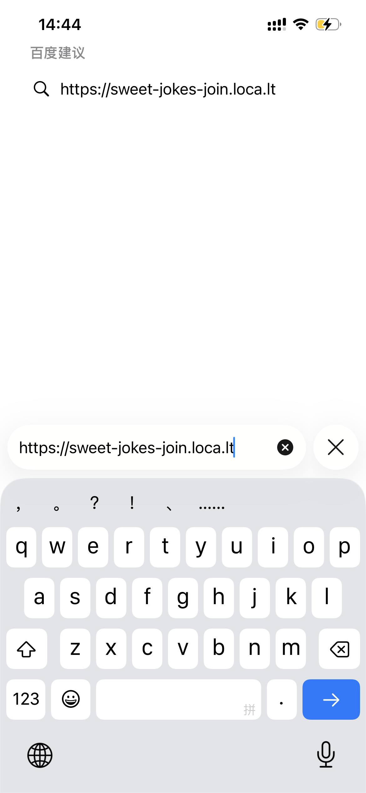
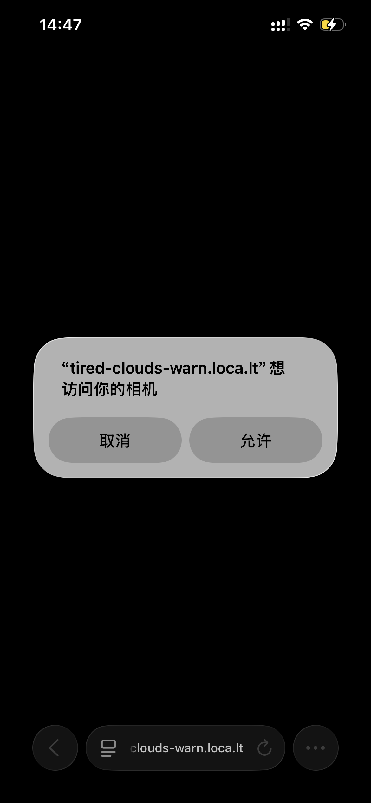
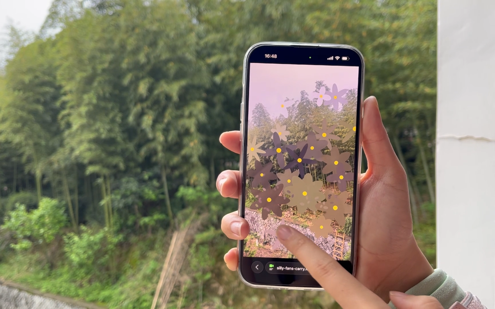

# AR Flower World

## Introduction
This is a Web AR interactive art piece based on p5.js. Users can capture the real environment through their mobile phone camera and “plant” flowers and falling petals that correspond to the colours of the environment by touching real objects on the screen.

## How to Run

1. Open the project folder in Visual Studio Code.
2. Start the project with Go Live so that it runs on port 5500.
3. In the VS Code terminal, type:

   npx localtunnel --port 5500
 
4. Copy the generated localtunnel link into the default browser on your mobile phone.
 
5. Enter the corresponding IP access code if required.
 
6. Allow camera access on your phone.
 
7. Move the phone camera around the environment, then tap the screen to generate flowers and swipe to release petals.
 
## Interaction
- **Tap**: grow flowers
- **Swipe**: release falling petals

## Technical Notes
- Built with p5.js
- Uses the mobile phone camera as a live background
- Flower and petal colours are sampled from the surrounding environment

## Important
This project runs correctly in its full version on desktop. During mobile testing, it may be necessary to remove the start screen code to allow the camera-based interaction to function properly.